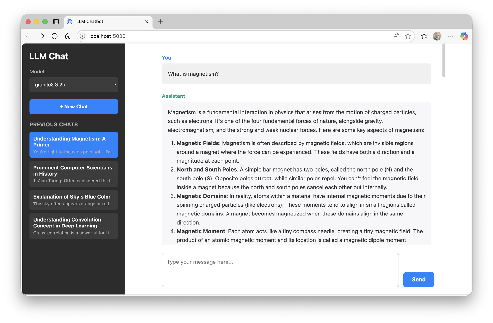
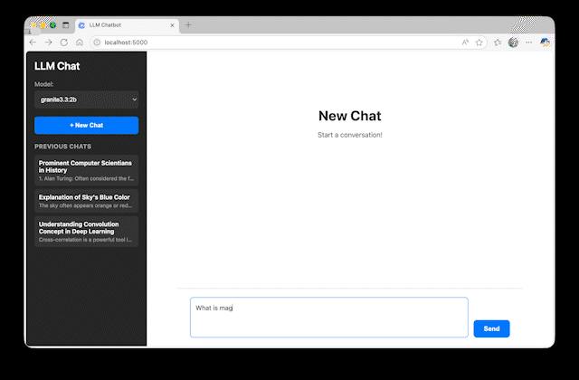
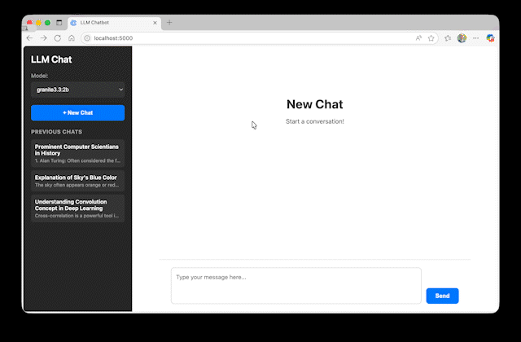
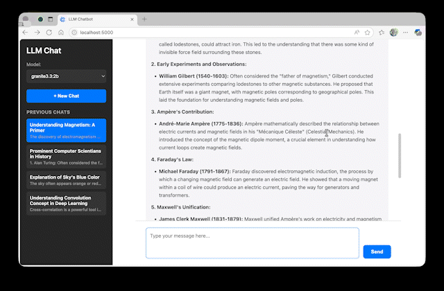
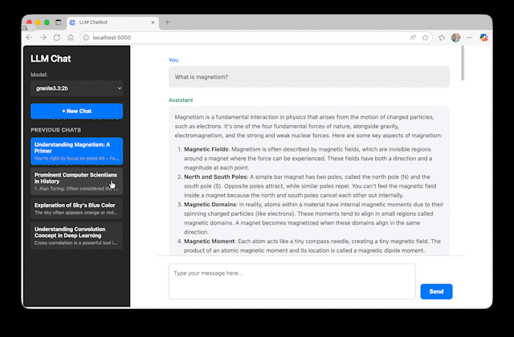

# denollama

> Minimal Deno-based chat interface for local Ollama models. No Node.js. No bundlers. Just Deno + Preact + vendored browser modules.



<p align="center">
  <a href="https://deno.com"></a>
  <a href="https://preactjs.com"></a>
  <a href="LICENSE"></a>
  
</p>

---

## Table of Contents
1. [Overview](#overview)
2. [Features](#features)
3. [Prerequisites](#prerequisites)
4. [Installation](#installation)
5. [Quick Start](#quick-start)
6. [Usage](#usage)
7. [Configuration](#configuration)
8. [Testing](#testing)
9. [API](#api-endpoints)
10. [Project Structure](#project-structure)
11. [Troubleshooting](#troubleshooting)
12. [Roadmap](#roadmap)
13. [License](#license)
14. [Credits](#credits)

---

## Overview
A clean, mobile-inspired chat UI to interact with models served by [Ollama](https://ollama.ai/). This fork keeps the original local-first workflow but swaps the backend for Deno/TypeScript, rewrites the frontend around Preact, and vendors browser dependencies locally so the app does not depend on runtime CDNs.

---

## Features

| Category | Description |
|----------|-------------|
| Chat Interface | Simple two-column layout with markdown-rendered model replies |
| Optional API-KEY Auth | Drop-in API key protection with automatic requirement detection |
| Local Models | Uses any model already pulled into your Ollama install |
| Model Picker | Dynamic dropdown of locally available models |
| Context | Sends last 3 messages each turn for coherent multi-turn dialogue |
| Auto Titles | First user prompt triggers a lightweight title generation request |
| History | Chats persisted in browser localStorage; reload and revisit anytime |
| Markdown | Supports code blocks, tables, lists via client-side rendering |
| Math | MathJax v4 renders common TeX delimiters in assistant replies |
| Copy Code | Copy button on code blocks in assistant replies |
| Vendored Frontend Runtime | Preact, htm, Marked, and MathJax are shipped locally under `static/vendor/` |
| Responsive | Feels like a compact mobile chat on wider screens |

### Chat Flow
The core experience: a clean conversation stream showing your prompts and the model's markdown-formatted replies. Messages auto-scroll, code blocks, lists, and tables render seamlessly for readability.



### Model Selection
Choose any locally available Ollama model on the fly. The dropdown is populated from the `/api/v1/models` endpoint so newly pulled models appear after a refresh. Switching models immediately affects subsequent prompts with no restart required.



### Conversation Context
Each new prompt sends the last three prior messages (user/assistant) to preserve short-term conversational grounding. This keeps responses relevant without heavy memory or manual summarization.



### Previous Chats
Every conversation is stored locally in your browser. Start a new chat to archive the current one, then revisit any past session instantly. Titles are auto-generated from the initial prompt for quick scanning.



---

## Prerequisites
- Deno 2.7+
- Ollama installed and running (`ollama serve`)
- At least one model pulled (for example `ollama pull llama2`)

Install Ollama: https://ollama.ai/download

Install Deno: https://docs.deno.com/runtime/getting_started/installation/

---

## Installation

```bash
cd denollama
deno task dev
```

The frontend runtime is already vendored, so there is no package manager install step.

---

## Quick Start
1. Pull a model: `ollama pull llama2`
2. Run Ollama: `ollama serve` (if not auto-started)
3. Start the web UI: `deno task dev`
4. Visit: http://localhost:5000

---

## Usage
1. Select a model in the left sidebar.
2. Type a prompt and send.
3. First prompt also triggers an automatic title request.
4. Click `New Chat` to archive the current conversation.
5. Load any previous chat from the history list.
6. Use the copy button in the top-right of assistant code blocks to copy snippets.

---

## Configuration
Environment variables:

```bash
PORT=8080 deno task dev
API_KEY=your-secret-key deno task dev
```

Ollama host (implicit): `http://localhost:11434`

### API Key Authentication

The application supports optional API key authentication to protect access. If you do not set an `API_KEY`, the app runs fully open. On startup the frontend first calls the public endpoint `/api/v1/auth-required` to determine whether it should prompt for a key.

1. Set an API key by providing the `API_KEY` environment variable when starting the server:
   ```bash
   API_KEY=your-secret-key deno task dev
   ```
2. Startup detection:
   - `{ "auth_required": true }` -> login form displayed
   - `{ "auth_required": false }` -> interface loads immediately
3. API key storage:
   - The key is stored in browser localStorage (`llm-api-key`)
   - Requests include the key as `X-API-Key`
4. Session expiration:
   - A `401` response clears the stored key and re-prompts

---

## Testing

The project includes a Deno-native test suite that exercises the backend behavior with a fake Ollama client, so no running Ollama instance is required for the tests.

### Run Tests

```bash
deno task test
```

### Current Coverage

The test suite covers:

- Index route and static HTML serving
- Static module MIME types for vendored browser modules
- Response endpoint validation and context handling
- Models endpoint behavior
- API key authentication
- Ollama error mapping
- HTTP method restrictions

---

## API Endpoints

**Note:** If `API_KEY` is set, all API endpoints require the `X-API-Key` header:

```text
X-API-Key: your-api-key
```

### POST /api/v1/response
Send a prompt with optional short context (last 3 messages).

**Request Headers:**
- `Content-Type: application/json`
- `X-API-Key: your-api-key` (required if `API_KEY` is set)

**Request Body:**

```json
{
  "prompt": "Explain attention mechanisms.",
  "model": "llama2",
  "context": [
    {"role": "user", "content": "Hi"},
    {"role": "assistant", "content": "Hello! How can I help?"}
  ]
}
```

**Response:**

```json
{
  "response": "Detailed explanation...",
  "model": "llama2"
}
```

### GET /api/v1/models
List models available locally.

**Response:**

```json
{
  "models": ["llama2", "granite3.3:2b"],
  "count": 2
}
```

### GET /api/v1/auth-required
Return whether API key auth is enabled.

**Response:**

```json
{
  "auth_required": false
}
```

---

## Project Structure

```text
denollama/
├── src/
│   ├── app.ts                    # Deno request handler and static serving
│   ├── ollama.ts                 # Ollama HTTP client wrapper
│   └── server.ts                 # Deno.serve entrypoint
├── tests/
│   ├── app_test.ts               # Backend contract tests
│   └── helpers.ts                # Small test helpers
├── static/
│   ├── index.html                # UI shell
│   ├── style.css                 # Application styles
│   ├── app.js                    # Preact client application
│   └── vendor/                   # Vendored browser runtime modules
├── readme-media/                 # Screenshots and animated GIFs
├── deno.json                     # Deno tasks and config
├── LICENSE                       # MIT License
└── README.md                     # Documentation
```

---

## Troubleshooting

| Issue | Checks |
|-------|--------|
| Empty model list | `ollama list` - ensure models are pulled |
| Connection errors | Is `ollama serve` running? Is port 11434 reachable? |
| Port conflict | Change with `PORT=7000 deno task dev` |
| Module MIME type errors | Ensure the app is being served through the Deno server, not opened directly from disk |
| Old frontend behavior | Hard refresh the browser after vendored asset changes |

---

## Roadmap
- [x] Streaming responses
- [x] MathJax support
- [x] Delete chats from history
- [ ] Frontend-specific tests
- [ ] Markdown sanitization
- [ ] Export chat as JSON/Markdown
- [ ] Optional system prompt injection
- [ ] Simple theming (dark/light toggle)

---

## License
MIT License. See [LICENSE](LICENSE).

---

## Credits
This project is a hard fork of the original **ollama-webui-llm** project by `imraf`:

- Original GitHub repository: https://github.com/imraf/ollama-webui-llm

The fork preserves the original app concept and much of the user-facing workflow, while porting the server to Deno/TypeScript and rebuilding the frontend around Preact with vendored browser dependencies.
